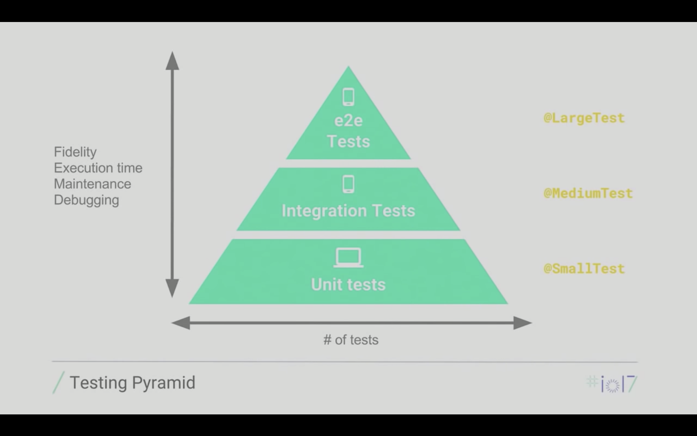

В современном мире многое зависит от скорости разработки. Чем быстрее выкатится фича, тем быстрее можно получить фидбэк от пользователя.
В случае стартапа скорость разработки может помочь захватить рынок. Windows Phone была неплохой системой, но вышла сильно позже Anroid и iOS.
Во многом из-за этого она не смогла захватить долю рынка.
Т.е. Вы должны быстро выкатывать кучу новых фич. 

Выкаченная фича — это когда:
1. код написан
2. выложен на прод
3. выполняет свою работу

И если первые два пункта без тестов получаются немного быстрее, то последний начинает тянуть вас вниз: 
программист без внешней помощи не может уследить за работоспособностью созданной им системы. 
И закрытые задачи начинают открываться обратно.

## Зачем писать тесты
1. Быстрая реакция на ошибки. 
Ошибки обнаруживаются до выкатки на прод. Стоимость их исправления сильно меньше.
2. Тесты дают "страховочную сеть". Если у вас хорошее покрытие тестами, то легче рефакторить и вносить изменение в систему.
У вас есть уверенность, что вы не поломаете поведение системы своими изменениями.
3. Вы можете придерживаться графика выпуска фич и НЕ утопать в фиксовых апдейтах. Когда надо фиксить что-то поломавшееся на проде.
4. Улучшается качество кода (архитектура), если он изначально написан с уклоном в тестирование.

## Пирамида тестирования

1. Unit тесты.
Тестируется самый маленький фрагмент системы. Например функция сложения в калькуляторе.

2. Интеграционные тесты.
Тестируется несколько взамосвязанных компонентов системы. Например форма заказа, но вместо отправки запроса на сервер, 
подставляется JSON файл. Полезно, когда сервер еще не написано, но известен формат его ответа.

3. e2e тесты (Функциональные, UI-тесты).
Тестируется вся система в целом. Тест производит те же шаги, какие бы делал реальный пользователь.

На пирамиде показано, что Unit-тестов должно быть больше всего и они самые точные (Fidelity), быстрые, легкие в поддержке.
Дальше идут интеграционные и e2e (end to end) тесты.  

