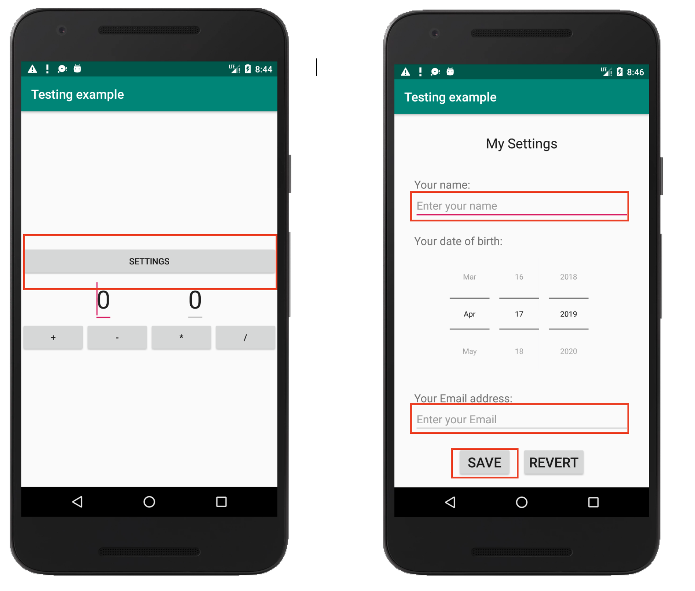
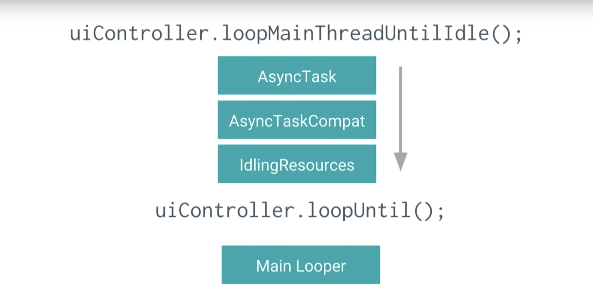
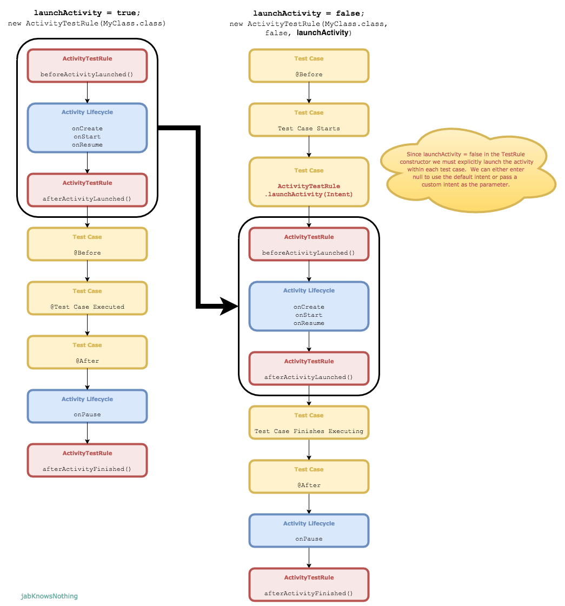
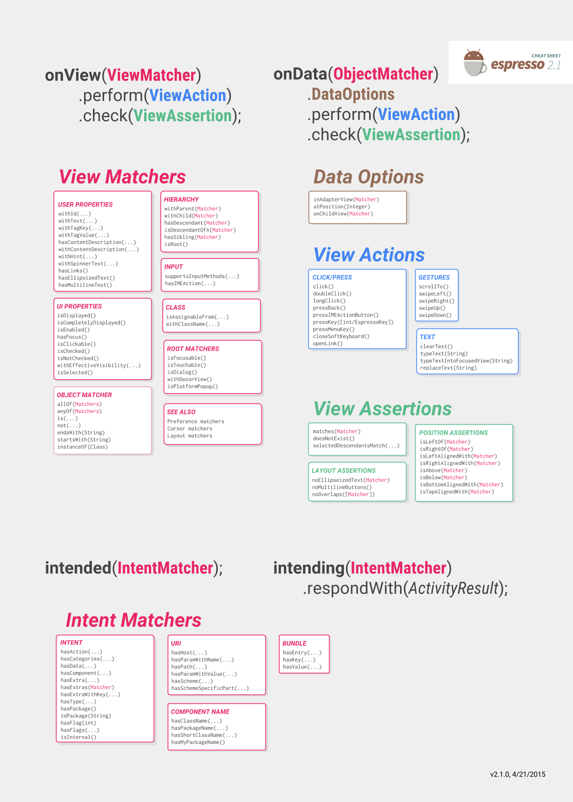
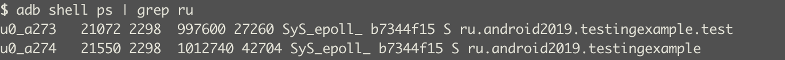
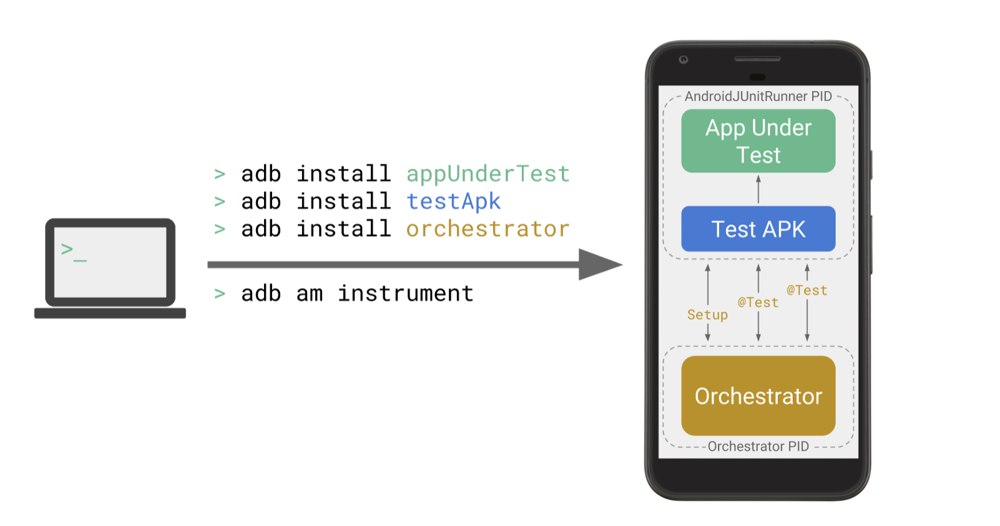

UI или e2e тесты применяются когда нам нам надо протестировать сложные сценарии, схожие с тем как бы вел себя пользователь
в приложении. Для этого используется Эмулятор или реальное Android устройство.

## Фреймворки для e2e тестирования.
Условно фреймворки можно разделить на два лагеря:
1. Использующие WebDriver Protocol. Это **Appium**
2. Использующие инструменты от гугла. **UIAutomator**, **Espresso**.

## Appium
Про этот фреймворк долго рассказывать не буду ибо мало пользовался им.

Appium это HTTP сервер, который ожидает соединений от клиентов, которые говорят какие сейчас нужны сессии, с какими устройствами
и какие тесты надо прогнать. Основная причина популярности Appium'а в том, что он использует тот же протокол, что и
Selenium. Из-за этого порог вхождения в него для тестировщиков, которые занимались Web'ом сильно ниже.


На диаграме выше показано взаимодействие клиента и Appium сервера.
Клиент отправляет запрос серверу по HTTP. Сервер создает сессию с устройством и устанавливает, и запускает APK.
Далее команды теста передаются через Appium сервер в bootstrap.jar. UIAutomator/Selendroid драйвер 
Здесь, bootstrap.jar играет роль TCP-сервера, который мы можем использовать, чтобы отправлять команды. 
Команды, в свою очередь выполняются на Android-устройстве средствами Selendroid или UIAutomator.

Плюсы:
1. Есть дополнительный уровень абстракции для команд UIAutomator'а. Если контракт методов изменится, то не надо будет
переписывать тесты, т.к. Аппиум драйвер возьмет на себя миграцию на новые методы.
2. Можно писать тесты почти на любом языке.
3. Низкий порог вхождения для тех, кто имел дело с Selenium'ом.
4. Не ограничены процессом приложения.
5. Кросс-платформенность, можно под IOS тесты писать.

Минусы:
1. Реализация оберток (аппиум-драверов) не реализует все методы.
2. Нет доступа к коду приложения.
3. Дополнительные уровни абстракции замедляют выполнение тестовых команд.
4. Проблемы с синхронизацией потоков.

## UIAutomator, Robotium
UIAutomator был первым фреймворком автоматизации созданным компанией Google.
Для его работы надо было упаковать тетсы и ранннер в отдельную APK и запустить на устройстве.
Сейчас ему на смену UIAutomator2.
Robotium спользовался как удобная обертка вокруг UIAutomator'а и до появления  Espresso многие пользовались ей.

Плюсы:
1. Можно автоматизировать любой компонент Операционной системы и приложения, как это делал бы пользователь.
2. Не ограничены процессом приложения.

Минусы:
1. Более долгая подготовка теста. Надо дополнительно собрать APK с тестами.
2. Скудное АПИ у UIAutomator'а.
5. Проблемы с синхронизацией потоков.

## Espresso
**UIAutomator** и **Espresso** - это часть **Android Testing Support library**.
Espresso фреймворк тесно взаимодействует с приложением и можно вызывать код приложения из тестов и берет заботу о синхронизации
на себя. Дальше мы будем говорить об **Espresso**.

Плюсы:
1. Удобное API для написания тестов.
2. Синхронизация из коробки.
3. Можно обращаться к коду приложения.

Минусы:
1. Более долгая подготовка теста. Надо дополнительно собрать APK с тестами.
2. Доступ только к приложению, вне процесса приложения Espresso ходить не может.


## Где лежат UI тесты
```groovy
sourceSets {
        androidTest {
            java.srcDirs = ['src/androidTest/java']
            assets.srcDirs = ['assets-androidTest']
        }
    }
```

Библиотеки подключаются в:
```groovy
dependencies {
    androidTestImplementation 'androidx.test:runner:1.1.1'
    androidTestImplementation 'androidx.test.espresso:espresso-core:3.1.1'
    androidTestImplementation 'androidx.test.ext:junit:1.1.0'
    androidTestImplementation "androidx.test:rules:1.1.1"
    androidTestImplementation 'androidx.test.espresso:espresso-intents:3.1.1'
}
```

Также мы должны указать какой раннер будет использоваться:
```groovy
android {
    defaultConfig {
        testInstrumentationRunner "androidx.test.runner.AndroidJUnitRunner"
        }
    }
```

## Простой тест для сохраненеия и проверки настроек
Напишем тест, который бы повторял действия пользователя. Надо будет нажать на `Settings`.
Заполнить поля логина и email'а и потом сохранить.
Для проверки исправим имя пользователя и нажмем `Revert` имя должно остаться таким же.

Пример можно посмотреть в `ru.android2019.testingexample.RevertSettingsTest`
```java
@RunWith(AndroidJUnit4.class)
public class RevertSettingsTest {

    public static final String ANTON = "Anton";
    public static final String EMAIL = "email@exmple.com";
    public static final String SOMETHING_WRONG = "Something wrong";

    @Test
    public void saveSettingsTest() {
        //Переходим в Settings
        onView(withId(R.id.settings)).perform(click());
        
        //вбиваем имя
        onView(withId(R.id.userNameInput)).perform(typeText(ANTON), closeSoftKeyboard());
        //вбиваем email
        onView(withId(R.id.emailInput)).perform(typeText(EMAIL), closeSoftKeyboard());
        //сохраняем
        onView(withId(R.id.saveButton)).perform(click());

        //Проверим, что имя откатывается обратно
        //Изменяем имя
        onView(withId(R.id.userNameInput)).perform(clearText()).perform(typeText(SOMETHING_WRONG), closeSoftKeyboard());
        //жмем Revert
        onView(withId(R.id.revertButton)).perform(click());
        
        //Проверяем, что имя, такое какое надо.
        onView(withId(R.id.userNameInput)).check(matches(withText(ANTON)));
    }
}
```

Из примера видно, что апи для написания тестов очень простое.
```java
onView(Matcher<View>)
            .perform(ViewAction);

onView(Matcher<View>).
            .check(ViewAssertion);
```

Эспрессо намеренно не дает доступ к `View`, позволяет работать только с `Matcher<View>` и  `ViewAction`, и `ViewAssertion`

```java
@Test
public void testSomeStuff(){
    onVew(...).viewFinder.getView() //так делать не надо
    
    View myView = mActivityRule.getActivity().findViewById(R.id.myView); //так тоже не стоит делать
}

```

## Ожидания в Espresso
Espresso берет на себя большую часть работы по ожиданию того, что сейчас подходящее время для выполнения действия.
Как выполняется синхронизация при выполнении действия в Espresso. Можно посмотреть в `ViewInteraction.java`
```java
    private void doPerform(final SingleExecutionViewAction viewAction) {
        runSynchronouslyOnUiThread(new Runnable(){
           //Проверяем что в очереди на  UI потоке нет сообщений
           uiController.loopMainThreadUntilIdle();

           //пытаемся сматчить вью в иерархии вьюх
            View targetView = viewFinder.getView();

            //производим действие над View
            viewAction.perform(uiController, targetView);

        });

    }
```

На картинке показано из чего состоит метод `loopMainThreadUntilIdle()`


Другими словами Эспрессо дожидается выполнения всех `BackGround` таск в AsyncTask'ах и AsyncTaskCompat'ах а потом проверят
очередь UI потока и дожидается чтобы она была пуста. Пуста означает, что следующее сообщение будет не раньше чем через 15 ms.


Если операция выполняется не в AsyncTask'е или слишком далеко в очереди UI потока, то для нее надо писать IdlingResource,
который будет дожидаться нужного события. Для этого надо реализовать интерфейс `IdlingResource`

```java
public class SimpleIdlingResource implements IdlingResource {

    @Nullable private volatile ResourceCallback mCallback;

    // Возвращаем это поле, когда происходт проверка Idle ли сейчас ресурс.
    private AtomicBoolean mIsIdleNow = new AtomicBoolean(true);

    //Имя необходимо, т.к. нужно обязательно регистрировать ресурс в Registry.
    //Иначе проверки не будет.
    @Override
    public String getName() {
        return this.getClass().getName();
    }

    //После регистрации ресурса будет опрашиваться этот метод до тех пор пока не
    //вернет true или не выйдет за границы setIdlingResourceTimeout и не выбросит IdlingResourceTimeoutException
    @Override
    public boolean isIdleNow() {
        return mIsIdleNow.get();
    }

    //Это callback который Espresso устанавливает для информирования, что ресурс готов к переходу из busy в idle.
    @Override
    public void registerIdleTransitionCallback(ResourceCallback callback) {
        mCallback = callback;
    }

    /**
     * Sets the new idle state, if isIdleNow is true, it pings the {@link ResourceCallback}.
     * @param isIdleNow false if there are pending operations, true if idle.
     */
    public void setIdleState(boolean isIdleNow) {
        mIsIdleNow.set(isIdleNow);
        if (isIdleNow && mCallback != null) {
            mCallback.onTransitionToIdle();
        }
    }
}
```

Чтобы эта магия начала работать надо зарегистрировать idlingResource, а когда он больше не нужен сделать unregister.
```java
IdlingRegistry.getInstance().register(mIdlingResource);

...
IdlingRegistry.getInstance().unregister(mIdlingResource);
```

Как было сказано ранее у Espresso есть таймауты для IdlingResource и uiController.loopUntil()

```java
public final class IdlingPolicies {
    //Указывает сколько надо ждать очередь в главном потоке, прежде чем выпасть по таймауту
    public static void setMasterPolicyTimeout(long timeout, TimeUnit unit) 
    
    //Устанавливает таймаут для IdlingResources
    public static void setIdlingResourceTimeout(long timeout, TimeUnit unit) 
}
```

## Старт Activity
Чтобы начать выполнять тесты в приложении его надо запустить.
У Espresso есть несколько инструментов для этого. Первый из них - это `ActivityTestRule`. В простейшем случае он просто 
запустит нужную `Activity` в приложении.
```java
  @Rule
  public ActivityTestRule<MyActivity> testRule = new ActivityTestRule<>(MyActivity.class);
```

Можно подготовить активити, потом запустить. Под подготовкой подразумевается например настройка дополнительных параметров для `Intent`
```java
@RunWith(AndroidJUnit4.class)
public class MultipleIntentsTest {
  @Rule
  public ActivityTestRule<MyActivity> testRule = new ActivityTestRule<>(MyActivity.class,
          false,    // initialTouchMode (default is false)
          false);  // launchActivity. Activity запустится при старте теста.

  @Test
  public void testOscarGrouchy() {
    Intent grouchyIntent = new Intent();
    // Настраиваем интент
    grouchyIntent.putExtra("EXTRA_FLAG", true);
    testRule.launchActivity(grouchyIntent);
    // Запускаем активити в экстра флагом
  }
  
  @Test
  public void testOscarNotGrouchy() {
    Intent happyIntent = new Intent();
    // intent stuff
    happyIntent.putExtra("EXTRA_FLAG", false);
    testRule.launchActivity(happyIntent);
    // Запускаем активити без экстра флага
  }
}
``` 

Вот как меняется порядок методов с разным способом вызова `ActivityTestRule` 



Второй способ запуска - это использовать `ActivityScenario`
```java
/**
     * {@link ActivityScenario используется для запуска и получения доступа к Activity.
     * {@link ActivityScenario#onActivity(ActivityScenario.ActivityAction)} дает thread-safe
     * механизм для доступа к Activity.
     */
    @Before
    public void registerIdlingResource() {
        ActivityScenario activityScenario = ActivityScenario.launch(IdlingActivity.class);

        //инициируем индлинг ресурс в активити.
        activityScenario.onActivity(new ActivityScenario.ActivityAction<IdlingActivity>() {
            @Override
            public void perform(IdlingActivity activity) {
                mIdlingResource = activity.getIdlingResource();
                // To prove that the test fails, omit this call:
                IdlingRegistry.getInstance().register(mIdlingResource);
            }
        });
    }
```
 
## Матчеры и локаторы
Для поиска `id` элементов используется LayoutInspector, это удобнее чем искать `id` в `layout.xml`
 
У Espresso обширная система готовых Matcher'ов.


Их можно комбинировать. Это может понадобиться когда надо усилить матчер.
```java
onView(allOf(withId(R.id.my_view), withText("Hello!")));

onView(allOf(withId(R.id.my_view), not(withText("Unwanted"))));
```

Иногда не найти подходящего матчера и приходится писать свой `testingexample.DatePickerTest`:
```java
    public static Matcher<View> matchesDate(final int year, final int month, final int day) {
        return new BoundedMatcher<View, DatePicker>(DatePicker.class) {

            @Override
            public void describeTo(Description description) {
                description.appendText("matches date:");
            }

            @Override
            protected boolean matchesSafely(DatePicker item) {
                return (year == item.getYear() && month == item.getMonth() + 1 && day == item.getDayOfMonth());
            }
        };
    }
```

## Запуски тестов
Самый простой способ запустить тесты это выбрать правой кнопкой нужный пакет и создать конфигурацию для тестов.

Из командной строки можно запустить как 
```groovy
./gradlew connectedCheck

//если нужно запустить по классу
./gradlew connectedCheck -Pandroid.testInstrumentationRunnerArguments.class=ru.android2019.testingexample.idlingResourceSample.ChangeTextBehaviorTest
```

Под капотом происходит следующее. Gradle таска:
1. Собирает Apk, которую будем тестировать.
```groovy
./gradlew assembleDebug
```
2. Собирает Apk c тестами и раннером.
```groovy
./gradlew assembleAndroidTest
``` 
3. находит подключенные устройства к адб-серверу.
```groovy
adb devices
```
4. Устанавливает их на все подключенные устройства.
```groovy
adb push
adb shell pm install
```
5. Потом запускает тесты
```groovy
adb shell am instrument -w -r   -e debug false -e class 'ru.android2019.testingexample.idlingResourceSample.ChangeTextBehaviorTest' ru.android2019.testingexample.test/androidx.test.runner.AndroidJUnitRunner
```

6. Собирает информацию и генерит отчет


7. Удаляет приложения

Espresso тесты запускаются в одном процессе с тестируемой апк, они запускаются в отдельном Instrumentation потоке
 
 

## Запуск через оркестратор
Гугл не так давтно зарелизила оркестратор. Который, который решает следующие проблемы:
1. Борется с крешами в приложении. Если во время выполнения тестового сьюта приложение крэшнулось.
МЫ не сможем продолжить выполнение оставшихся тестов, т.к. Intrumentation поток тоже завершится вместе с крашем приложения.

2. Оркестратор запускает новый инстанс приложения на каждый тест. Это позволяет очищать состояние приложения после кажого 
теста.



## Что почитать и посмотреть

1. [https://www.youtube.com/watch?v=isihPOY2vS4](https://www.youtube.com/watch?v=isihPOY2vS4) - главные фишки Espresso
2. [https://codelabs.developers.google.com/codelabs/android-testing/#0](https://codelabs.developers.google.com/codelabs/android-testing/#0) - MUST HAVE CODE LAB
3. [https://developer.android.com/training/testing/espresso/basics](https://developer.android.com/training/testing/espresso/basics) - Espresso для начинающих
4. [https://medium.com/@dnkilic/espresso-recipes-for-android-afb2466b8137](https://medium.com/@dnkilic/espresso-recipes-for-android-afb2466b8137) - рецепты Espresso
5. [https://www.youtube.com/watch?v=pK7W5npkhho](https://www.youtube.com/watch?v=pK7W5npkhho) - что нового в инструментах тестирования
6. [https://jabknowsnothing.wordpress.com/](https://jabknowsnothing.wordpress.com/) - о старте активити в тестах

