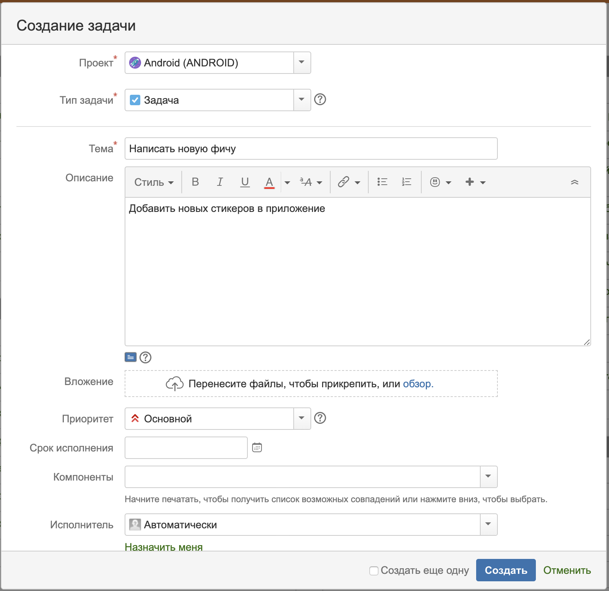
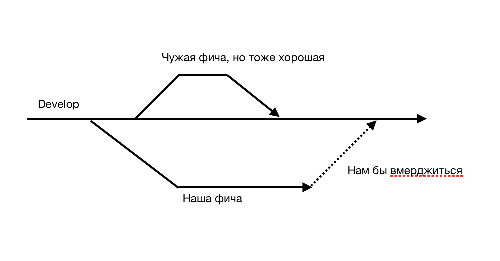
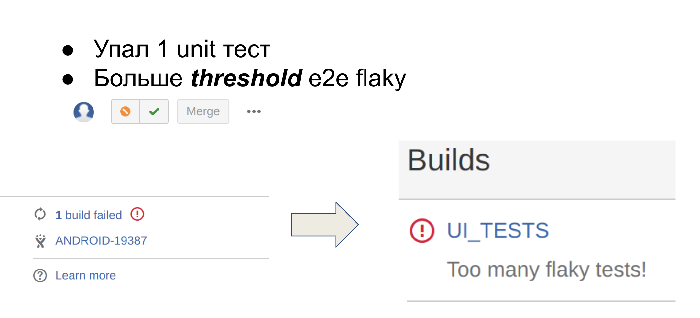
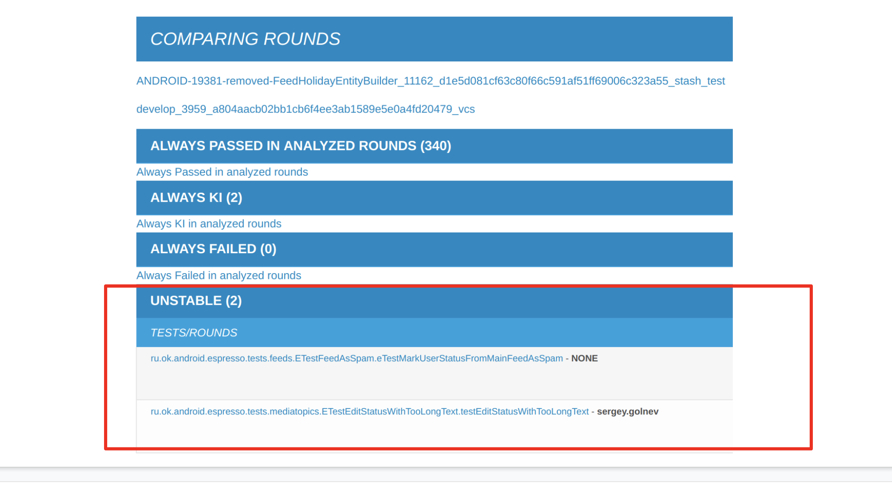
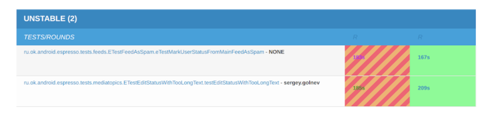

Все что было описано выше - это хорошо и легко, когда работает один человек и у него много свободного времени. Т.е. он
может собрать проект и запустить тесты, посмотреть результаты. Т.к. он работает один, то скорее всего ему будет легко
найти ошибки и поправвить. Но все меняется когда команда разработки начинает расти и фичи надо выпускать раз в неделю.
Рассмотрим то как ведется процесс разработки у нас.

## CI/CD
Под термином обычно понимают автоматическую сборку и прогон тестов после слияния веток.
Рассмотрим, что происходит с момента создания твски до готового приложения.

1. Разработчику прилетает таска в Jire (там конечно описания по-больше будет).

2. Он отводит ветку под эту задачу и начинает ее делать.
Он работает в своей ветке и по готовности делает пулл-реквест.

3. Пул-реквест смотрят другие разработчики и пишут замечания.

4. Также на пулл-реквест запускаются Unit и UI тесты, но не совсем обычно.
Мы не запускаем тесты на чистой бранче, так как там могут быть изменения, которые могут сломать нам девелоп.

5. Мы подмердживаем `develop` себе в ветку и гоняем на таком гибриде.
Это делается для того чтобы девелоп был всегда зеленый.

6. Если падают Unit'ы, значит, что при мердже в `develop` разработчик бы сломал его.
Тогда мы запрещаем ему мерджить в стеше.

7. Для UI-тестов мы присылаем отчет о сравнении двух раундов. Того, который подмержили (develop) и для ветки с подмердженным
develop'ом.
 
8. UI тесты иногда падают не из-за ошибок, а из-за других проблем, поэтому разработчик может перейти в отчет и проверить.
 

9. Если у нет замечаний и тесты все прошли, то разработчик может вмерджить всой пул-реквест.
10. Дальше в определенный день (code freeze) ветка `develop` отводится в `stable` и тестировщики провяют новые фичи, на 
которые пока не написаны автоматизированные тесты. Вносятся исправления в `stable`.
11. В пятницу собирается релизная версия приложения. А в воскресенье начинается раскатка на 5%.
12. С новой недели анализируются крэши и раскатка продолжается.

## Ферма UI тестов
 
 
