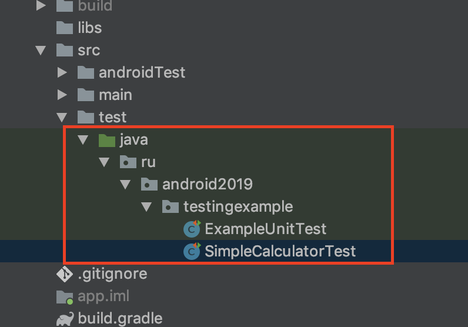
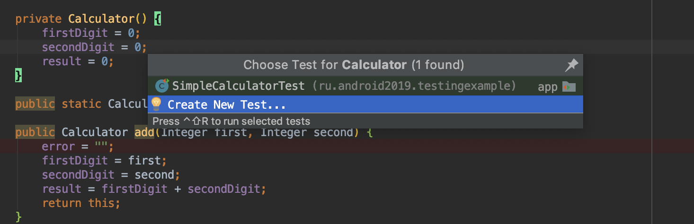

Сначала немного скучной теории:

## Когда можно применять.
1. Когда нужно эмулировать сложные ошибки, использовать знание о коде для того чтобы проверить 
все ветвления приложения и различные состояние объектов которые крайне тяжело эмулировать в e2e тестировании.
2. Когда приложение еще не готово. При написании Unit тестов нет необходимости дожидаться готовности кода всего приложения
или даже отдельного компонента, можно писать тесты только для одного метода.
3. Когда надо быстро находить ошибки. 
Если ошибка существует, то для ее обнаружения и устранения как правило понадобится меньше времени, чем при дебаггинге приложения.
4. Когда добавление очередного Unit теста вызывает затруднение, либо Unit тест получается громоздким и запутанным.
Также, если нет возможности проверить метод в изоляции, вероятнее всего код имеет высокую связность (high coupling)
5. Когда надо вспомнить как работает метод.
Unit тесты являются своеобразной «документацией в примерах» для кода проекта.

## Первый JUnit тест
Unit-тесты в андроиде по умолчанию хранятся в **src/test/java**. 

Другое место хранения можно настроить в секции `sourceSets` в gradle файле приложения.
```groovy
android {
    sourceSets {
        test {
            java.srcDirs = ['src/test/java',
                            'src/test_utils/java']
            resources.srcDirs = ['src/test/resources']
        }
    }
}

```

На рисунке видно, что мы добавили еще папку `test_utils`. Она тоже будет использоваться при выполнения тестов. Там
будут лежать утилиты.
Также на рисунке видно, что для тестовой конфигурации используется конструкция **testImplementation**. Если какая-то билблиотека
нужна для Unit-тестов, то подключаем ее или в **testImplementation** или в **testApi**.

В приложении **Testing example** есть класс `Calculator`, который выполняет вычисления:
```java
public class Calculator {
    private Integer result;
    private Integer firstDigit;
    private Integer secondDigit;
    private String error;
    private static final Calculator instance = new Calculator();

    private Calculator() {
        firstDigit = 0;
        secondDigit = 0;
        result = 0;
    }

    public static Calculator getInstance() {
        return instance;
    }

    public Calculator add(Integer first, Integer second) {
        error = "";
        firstDigit = first;
        secondDigit = second;
        result = firstDigit + secondDigit;
        return this;
    }

    public Calculator subtract(Integer first, Integer second) {
        error = "";
        firstDigit = first;
        secondDigit = second;
        result = firstDigit - secondDigit;
        return this;
    }

    public Calculator multiply(Integer first, Integer second) {
        error = "";
        firstDigit = first;
        secondDigit = second;
        result = firstDigit * secondDigit;
        return this;
    }

    public Calculator divide(Integer first, Integer second) {
        error = "";
        firstDigit = first;
        secondDigit = second;
        if (secondDigit.equals(0)) {
            error = "На ноль делить нельзя";
            return this;
        }
        result = firstDigit / secondDigit;
        return this;
    }
}

```

Это чистый Java код. В нем нет ничего от Android. А значит мы можем создать Unit тест, который будет для нас тестировать этот класс.
Самый простой способ создать Unit-тест. Это кликнуть правой кнопкой в теле класса и выбрать **Go To**.

Дальше можно выбрать куда добавить новый тест. Это может быть как новый класс, так и существующий.



Дальше будет "мастер", в котором можно выбрать:
* тип теста. Мы сейчас говорим о JUnit4, который является стандартом.
* Название класса с тестами. По умолчанию к классу добавляется суффикс Test.
* Класс родитель, если есть.
* package. Важная вещь. Если тестовый класс находится в таком же пакете как и класс приложения, то мы будем иметь доступ
к его **protected** и  **package-private** методам. В противном случае, мы сможем обращаться только к **public** методам. Без ухищрений.
* Дальше можно выбрать создавать ли нам фикстуры для настройки состояния тестов.
* Можно выбрать методы для которых писать тесты.


Я создам один тест в классе `SimpleCalculatorTest`
`
```java
@RunWith(JUnit4.class)
public class SimpleCalculatorTest {
    private Calculator calculator;

    @Before
    public void setUp() {
        calculator = Calculator.getInstance();
    }

    @Test
    public void additionTest() {
        calculator.add(2, 3);
        Assert.assertEquals(5, calculator.getResult());
    }
}
```

1. Аннотация `@RunWith` показывает какой раннер будет использован для запуска тестов. В простейшем случае, когда используются
только Junit4 тесты, эту аннотацию можно опустить. Раннер должен знать как ему искать тесты. Для JUnit4, раннер будет искать все
методы внутри класса, которые помечены аннотацией `@Test`.
2. Нужен public класс, который выступит хранилищем тестов `SimpleCalculatorTest`.
3. Это аннотация для обозначния фикстуры (о них ниже).
4. Сам тест.

Сначала создаем экземпляр класса Calculator. На нем будем проводить тест
Складываем два числа 2 и 3, они запишутся в поле result внутри класса Calculator.
Методом assertEquals сравниваем ожидаемый результат и то, что вернет нам Сalculator. 
Если значения окажутся не равны, то при запуске теста метод assertEquals выбросит ошибку.

## Фикстуры
Фикстуры - фиксированные состояния объектов используемые в качестве исходных данных при запуске тестов.
Фикстуры позволяют многократно использовать один и тот же исходный код, в случае, если исходные данные для нескольких тестов одинаковые.
1. Аннотация `@Before` обозначает методы, которые будут вызваны до исполнения теста, методы должны быть public void. 
Здесь обычно размещаются предустановки для теста, в нашем случае это получение инстанса Calculator.
2. Аннотация `@BeforeClass` обозначает методы, которые будут вызваны до создания экземпляра тест-класса,
методы должны быть public static void. Это однократная
3. Аннотация `@After` обозначает методы, которые будут вызваны после выполнения теста, методы должны быть public void. 
Здесь размещаются операции освобождения ресурсов после теста, .
4. Аннотация `@AfterClass` связана по смыслу с @BeforeClass, выполняется один раз после прогона всех тестов.

В классе `FixturesExampleWithRule` есть следующий код:
```java
    @Rule
        public TestName name = new TestName();
    
        @BeforeClass
        public static void setupClass() {
            System.out.println("BeforeClass SimpleCalculatorTestWithRule started");
        }
    
        @Before
        public void setUp() {
            System.out.println(String.format("Test name %s started", name.getMethodName()));
            calculator = Calculator.getInstance();
        }
    
        @Test
        public void multiplicationTest() {
            calculator.multiply(2, 3);
            Assert.assertEquals(6, calculator.getResult());
        }
    
        @Test
        public void divisionTest() {
            calculator.divide(6, 3);
            Assert.assertEquals(2, calculator.getResult());
        }
    
        @After
        public void tearDown() {
            System.out.println(String.format("Test name %s finished", name.getMethodName()));
        }
    
        @AfterClass
        public static void tearDownClass() {
            System.out.println("BeforeClass SimpleCalculatorTestWithRule finished");
        }
```
Здесь два теста и 4 фикстуры. После запуска класса в консоль выведется следующее:
```
BeforeClass FixturesExampleWithRule started

    Test name divideTest started
    Test name divideTest finished

    Test name multiplicationTest started
    Test name multiplicationTest finished

BeforeClass FixturesExampleWithRule finished
```

## Правила
Кроме всего вышеперечисленного есть довольно интересная вещь — правила. 
Правила это некое подобие утилит для тестов, которые добавляют функционал до и после выполнения теста.

Например, есть встроенные правила для задания таймаута для теста(Timeout), для задания ожидаемых исключений(ExpectedException), для работы с временными файлами(TemporaryFolder) и д.р. 
Для объявления правила необходимо создать public не static поле типа производного от MethodRule и зааннотировать его с помощью Rule.
Пример в `RulesExample` классе.

Правила выполняются после `@Before` и после `@BeforeClass`


## Дополнительные аннотации для тестов
Можно извлечь дополнительную функциональность из аннотации `@Test`
* Тест будет работать не больше секунды, а потом упадет
  `@Test(timeout = 1000)`    
*Аннотация для перехвата исключения
 `@Test(expected = IllegalStateException.class)`        
*Тест не будет выполняться
`@Ignore("Разберусь потом")`
Пример в `TestAnnotationParameters` классе.

##Утверждения
В каждом тесте должно быть хотя бы одоно утверждение (assert).
Они необходимы иначе тест будет постоянно проходить и будет бесполезен.
```java
Assert.assertTrue(String message, boolean condition)
Assert.assertFalse(String message, boolean condition)
AssertNull(Object object)
Assert.Equals(Object expected, Object actual)
...
```

Пройдемся по параметрам:
* `message` - это сообщение, которые будет выброшено при наступлении ошибки. Лучше написать его наиболее понятным, чтобы
быстрее разобраться в корне проблемы.
* `condition` - это условие, которое должно вернуть `boolean`. Возьмем пример с вычитанием.
```java
int result = 1 - 2;
Assert.assertTrue("Результат 1 - 2 должен быть меньше нуля", result < 0);
```
* `expected` - это эталонное значение, с которым сравниваем (опираемся на него).
* `actual` - это значение, которое получили во время теста.
```java
int result = 1 - 2;
//Если сообщения будут не равны, Junit напишет значения expected и actual, поэтому в большинстве случаев, 
//сообщение можно опустить.
Assert.assertEquals(-1, result);
```

Гугл рекомендует юзать свою либу для ассершена [Туториал к Google Truth](http://google.github.io/truth/).
Также есть библиотека [Туториал к hamcrest либе](http://hamcrest.org/JavaHamcrest/tutorial), в которой много много дополнительных матчеров.
Она намного чаще используется в паре с JUnit'ом.

## Как запускать тесты
Запускать можно с помощью кнопки **play**. В меню можно выбрать нужный метод запуска.

С помощью кнопки плэй можно запустить как один тест в классе так и все тесты внутри класса.
Также тесты можно запустить с помощью **gradle**.
Так запустятся все тесты во всех модулях.
```groovy
./gradlew test
```
Можно добавить фильтрации с помощью ключа `--tests`
```groovy
//выполнить все тесты в SimpleCalculatorTest классе
./gradlew app:testDebugUnitTest --tests SimpleCalculatorTest

//выполнить один тест в SimpleCalculatorTest
./gradlew test --tests SimpleCalculatorTest.additionTest

//выполнить тесты по маске внутри класса
./gradlew test  --tests SimpleCalculatorTest.*addition*

//указание класса через fqn
./gradlew app:testDebugUnitTest  --tests ru.android2019.testingexample.SimpleCalculatorTest

//указание класса и метода через fqn
./gradlew app:testDebugUnitTest  --tests ru.android2019.testingexample.SimpleCalculatorTest.additionTest

//все тесты внутри пакета (рекурсивно)
./gradlew app:testDebugUnitTest --tests ru.android2019.testingexample.*

```

## Моки и стабы
Не всегда есть возможность создать все объекты для теста функции:
1. Иногда это слишком сложно из-за большой вложенности параметров и объектов.
2. Иногда нужного класса еще нет или он может поменять поведение.
3. Иногда объект производит неопределенные результаты (например текущее время)
Для того чтобы справиться с этими ситуациями были придуманы Моки (объекты заглушки, тестовые дубли)
Такой объект иммитирует поведение объекта или может добавлять дополнительную информацию к нему (Spy)

Немного скучной теории:

1. Dummy object - когда реализация объекта совсем не важна, ее даже можно заменить на `null`
```java
@Test
public void addCustomerWithDummyTest() {
 //dummy не имеет никакого переопределенного поведения
 Customer dummy = mock(Customer.class);
 AddressBook addressBook = new AddressBook();
 addressBook.addCustomer(dummy);
 Assert.assertEquals(1, addressBook.getNumberOfCustomers());
}
```

2. Test Stub - Когда мы возвращаем фиксированные значения для методов объектов.
В примере ниже это значение для размера списка
```java
when(mockedList.size()).thenReturn(100);
```

3. Mock Object - объекты которые позволяют контролировать поведение объектов во время тестов.
В терминах Mockito - это может быть конструкция 
```java
verify(stringListMock).add("somestring");
```

4. Test Spy - реальный объект, чьи методы можно переопределить.

5. Fake Object - специальный объект, который может выглядеть как реальный, но сконструирован только для 
теста. В полях может быть билиберда сгенирированная

Самая популярная библиотека для создания Моков - это [Mockito](https://site.mockito.org/)
Для ее работы надо добавить ее в `build.gradle`
```groovy
testCompile 'org.mockito:mockito-core:2.8.0'
```
В тестах, в классе  `ru.android2019.testingexample.emailValidator.SharedPreferencesHelperTest` будем использовать Mockito
чтобы создать заглушку для `SharedPreferences`. Т.к. `SharedPreferences` это часть Android API мы не сможем протестировать
ее в локально JVM, поэтому мы сделаем объект, который будет повторять нужное нам поведение и выдавать себя за `SharedPreferences`.

Мокированный объект можно создать двумя способами:

1. Вызвать статический метод `mock` на прямую. Создастся пустой объект, который не умеет ничего делать. 
```java
SharedPreferences.Editor mMockEditor = mock(SharedPreferences.Editor.class);
``` 
2. С помощью аннотации `@Mock`. Для ее правильной работы надо обязательно инициировать ее
```java
    @Mock
    SharedPreferences mMockSharedPreferences;
    
    @Before
    public void initMocks() {
        //инициализация аннотаций
        MockitoAnnotations.initMocks(this);
    }
```

3. Далее нам надо настроить объект заглушку
Для этого используется конструкция  `when` ... `thenReturn`
В примере ниже при запросе настройки по `KEY_NAME="key_name"` нам будет возвращаться `TEST_NAME = "Test name"`
Т.е. если где-то в тесте мы вызовем ` mSharedPreferences.getString(KEY_NAME, "");` нам вернется `"Test name"`
Полную настройку можно посмотреть с `emailValidator.SharedPreferencesHelperTest#createMockSharedPreference`
```java
when(mMockSharedPreferences.getString(eq(SharedPreferencesHelper.KEY_NAME), anyString()))
                .thenReturn(mSharedPreferenceEntry.getName());
```

## Методы Mockito 
Другие методы, которые предоставляет Mockito мы посмотрим немного в отрыве от Android
1. `@Spy` - эта аннотация создает обертку вокруг реального объекта. Т.е. в отличие от `@Mock` у нас получится не пустая 
заглушка, а полноценный `ArrayList<String>` со всеми методами, но мы также можем переопределять нужные нам методы.
В примере ниже был переопределен метод `size()`
```java
    @Spy
    List<String> spiedList = new ArrayList<String>();

    @Before
    public void initMocks() {
        MockitoAnnotations.initMocks(this);
    }

    @Test
    public void spyAnnotation() {
        //Добавляем сторочки в лист. Он должен вести себя также как обычный ArrayList.
        spiedList.add("one");
        spiedList.add("one");
        spiedList.add("two");

        //Проверяем, что метод add("one") вызывался два раза
        verify(spiedList,times(2)).add("one");
        verify(spiedList).add("two");

        assertEquals(3, spiedList.size());

        //Переопределяем метод size() для ArrayList
        Mockito.doReturn(100).when(spiedList).size();
        assertEquals(100, spiedList.size());
    }
```

2. `@Captor` - аннотация для `ArgumentCaptor` позволяет перехватывать переданные аргументы в функцию и сравнивать их в ассертах.
Следующий пример слишком простой, но если бы на месте строки был сложный объект, это было бы полезно.
```java
@Mock
    List<String> mockedList;

    //с помощью каптора можем проверять значения аргументов.
    @Captor
    ArgumentCaptor<String> argCaptor;

    @Before
    public void initMocks() {
        //Необходимая инициализация
        MockitoAnnotations.initMocks(this);

    }

    @Test
    public void whenUseCaptorAnnotation_thenTheSam() {
        mockedList.add("one");
        Mockito.verify(mockedList).add(argCaptor.capture());

        assertEquals("one", argCaptor.getValue());
    }
``` 

3. `@InjectMocks` - позволяет подставлять уже мокированные объекты в  объект с этой аннотацией.
```java
    @Mock
    Map<String, String> wordMap;
    
    //автоматически подставляем wordMap в MyDictionary
    @InjectMocks
    MyDictionary dic = new MyDictionary();

    @Before
    public void initMocks() {
        //Необходимая инициализация
        MockitoAnnotations.initMocks(this);
    }

    @Test
    public void whenUseInjectMocksAnnotation_thenCorrect() {
        Mockito.when(wordMap.get("aWord")).thenReturn("aMeaning");

        assertEquals("aMeaning", dic.getMeaning("aWord"));
    }

    public class MyDictionary {
        Map<String, String> wordMap;

        public MyDictionary() {
            wordMap = new HashMap<String, String>();
        }

        public void add(final String word, final String meaning) {
            wordMap.put(word, meaning);
        }

        public String getMeaning(final String word) {
            return wordMap.get(word);
        }
    }
```
## PowerMock

Мокито не умеет делать стабы на статические или приватные методы (в последних версиях это добавили, но фича позиционируется,
как incubating).
Для этого используется библиотека [PowerMock](https://github.com/powermock/powermock/wiki/Getting-Started)
она поставляется как расширение для Mockito. На данный момент Mockito 2 поддерживается в экспериментальном режиме и 
иногда приходтся помучаться с зависимостями. Зато с помощью PowerMock можно протестировать практически любой код, даже
который не спроектирован для тестирования.
```java
@RunWith(PowerMockRunner.class)
@PrepareForTest(EmailValidator.class)
public class PowerMockTest {
    @Test
    public void powerMockTest() {
        PowerMockito.mockStatic(EmailValidator.class);
        //смогли замокать статический метод
        PowerMockito.when(EmailValidator.isValidEmail(anyString())).thenReturn(true);
        assertTrue(EmailValidator.isValidEmail("not real email"));
    }
}
```
Пример можно посмотреть здесь `ru.android2019.testingexample.powerMockExample.PowerMockTest`

## Robolectric 
При использовании не замоканного кода Android фреймворка, можно получить исключение.
RuntimeException c причиной — method not mocked при попытке запустить тест кода вызывающего какой — либо метод фреймворка.

Если использовать следующую опцию в Gradle
```groovy
testOptions {
    unitTests.returnDefaultValues = true
}
```
то, RuntimeException брошен не будет. Такое поведение может приводить к тяжело детектируемым ошибкам в тестах.

На помощь приходит Robolectric -  это специальная опен-сорсная библиотека, которая состоит из специально скомпилированного `android.jar`
с обвязкой из утилит для запуска тестов и упрощения тестирования. Он поддерживает загрузку ресурсов, 
примитивную реализацию инфлэйта View (не поддерживает CustomView), предоставляет локальную SQLite (sqlite4java), 
легко кастомизируем и расширяем. Тесты с использованием Robolectric уже относятся к интеграционным, они стоят между
Unit-тестами и Instrumentation тестами. Хранятся они вместе с Unit-тестами, т.к. выполняются на локальной JVM.
либо других ресурсов приложения, т.к. они являются неотъемлемой частью бизнес — требований.

Роболектрик хорошо подходит для тестирования следующих объектов Android FrameWork'а:

* Parcelable — нужно проверять корректоность сериализации и восстановления.

* SQLite — тестирование миграции данных, изменения схем, добавление новых таблиц, корректность выполнения запросов.
Распространенный кейс это проверка баз при обновлении приложения.

* Shared Preferences - запись и чтение.

* Intent / Bundle — флаги, с которыми будет запущена следующая Activity или Service.

В тестовом классе `ru.android2019.testingexample.emailValidator.RobolectricSharedPreferencesHelperTest`
Robolectric сам создает для нас `DefaultSharedPreference` и можем работать с ним как будто приложение запущено на устройстве.

Для использования Robolectric надо добавить следующие строчки в `build.gradle`
```groovy
    testImplementation 'org.robolectric:robolectric:4.0.2'
    //for Robolectric
    testImplementation 'androidx.test:core:1.1.0'
```
```java
 @Test
        public void addsDataToSharedPreference() {
            Application application = ApplicationProvider.getApplicationContext();
            mSharedPreferences =  PreferenceManager.getDefaultSharedPreferences(application);
        ...
        }
```

Robolectric может запускать тесты для определенной версии sdk или для ориентации или разрешения экрана, или языка.
```java
  @Config(sdk=JELLYBEAN_MR1,
      qualifiers = "fr-xlarge")
  public class SandwichTest {
  }
```

Роболектрик не может работать с:
* Native кодом - Android native код не может быть исполнен на локальной JVM.
* Вызовами вне процесса - На локально ймашине не запущены Android system services.

Роболектрик решает эту проблему с помощью классов, которые называются Shadows.
Каждый Shadow объект может модифицировать или расширять поведение нужного класса в Android OS.
Когда создается объект Android класса, Robolectric ищет соответствующий ему Shadow класс, если находит,
то создает Shadow объект и связывает его с Android обхектом.

Через инструментирование Байт-кода Роболектрик может создавать кросс-платформенную прокси имплементацию, чтобы заместить ею
native код и добавить дополнительное API, чтобы сделать тестирование возможным. 

Возьмем класс `ShadowView` он является Shadow для класса `View` из Андроида. При обращении ко `View` внутри Robolectric
теста, будет использован этот класс.

```java
//
@Implements(View.class)
public class ShadowView {
    @Implementation
      protected void setOnClickListener(View.OnClickListener onClickListener) {
        this.onClickListener = onClickListener;
        directly().setOnClickListener(onClickListener);
      }
}
```

Роболектрик лучше не использовать для тестов:
* В которых много перемещений между Activity
* В которых применяется много потоков и нужна синхронизация между ними.


  

